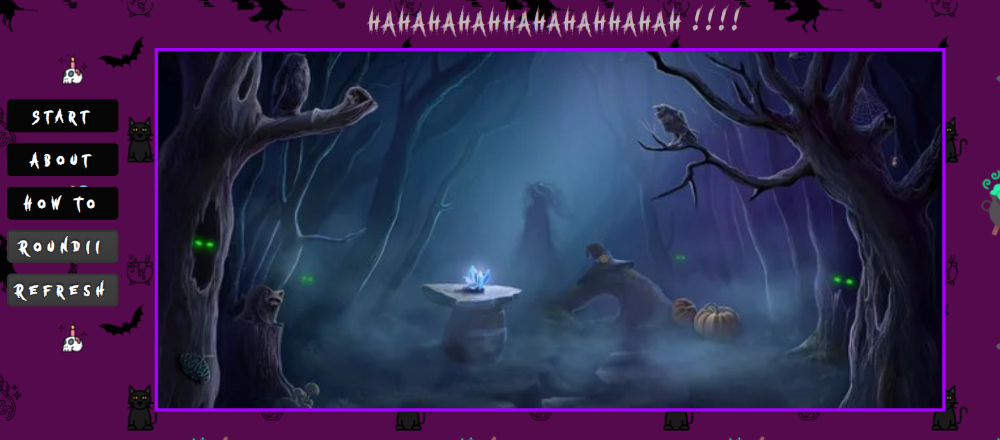
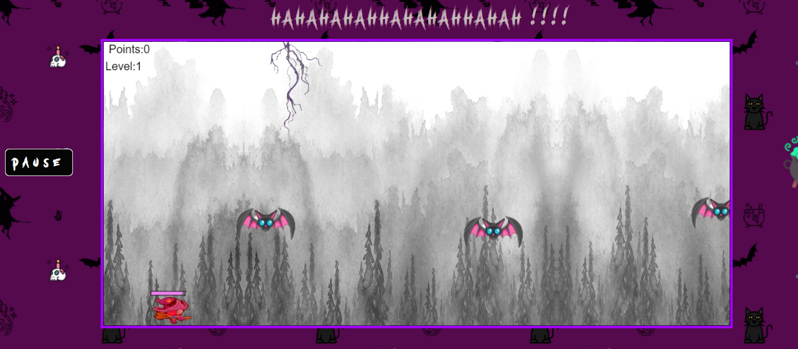
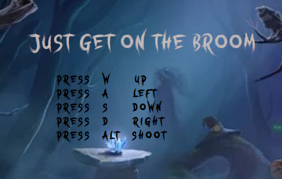

<h1>Flappy Witch Game, my first Project in Ironhack!!!</h1>

This is a game about a little witch that goes around fighting monsters.
I used Javascript, css and html languages.
The easy part was building the player and backgrounds until I decided to do levels...
So, the class enemy takes the object enemy from an enemies array,and each index of the main enemy array is for each level of the game.
The witch shoots, it is the only way she can kill the monsters.
There are 3 buttons, one for playing and pause the game (play); one for Know bwtter the witch(about) and the last one to know the keyboard buttons to use (how to).

I would like to implement in the future more enemies and others champions , more obstacules and even regain life objects.

thanks for reading ;)

